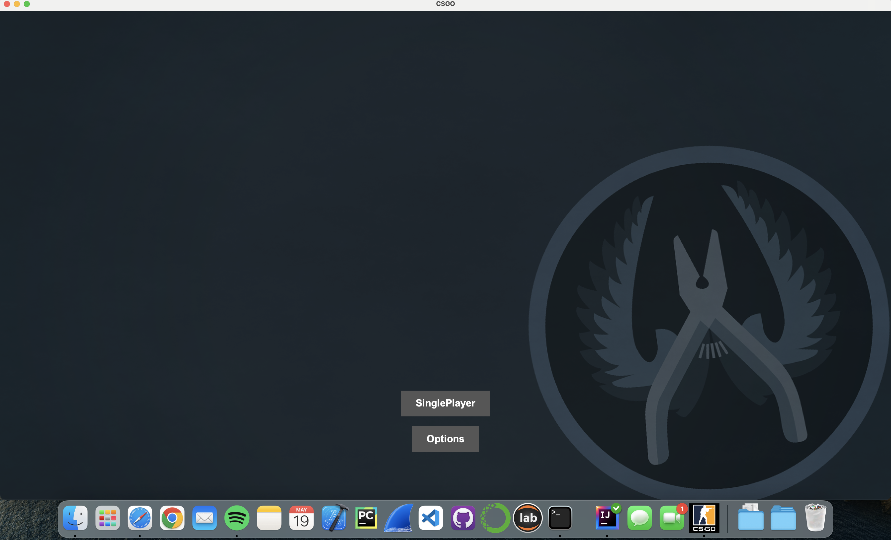
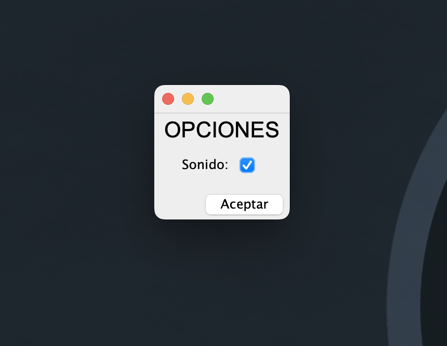

# CSGO

En primer lugar se ha utilizado Blender para hacer un modelo del mapa 3D que posteriormente utilizaremos para jugar. 

## Ventana inicio
Ventana que aparece al iniciar el programa, desde la que se puede, entre otras cosas, iniciar el juego. O activar/desactivar la musica. Cabe recalcar, como se ha modificado también el logo de la App.

## Panel Opciones
Panel de Opciones: Puedes activar o desactivar la opcion de la musica

## Nivel del Juego
Este es un ejemplo de uno de los niveles del juego

## GameOver Juego
Pantalla perdedor del Juego

## Ganador del Juego
Pantalla Ganador del Juego

